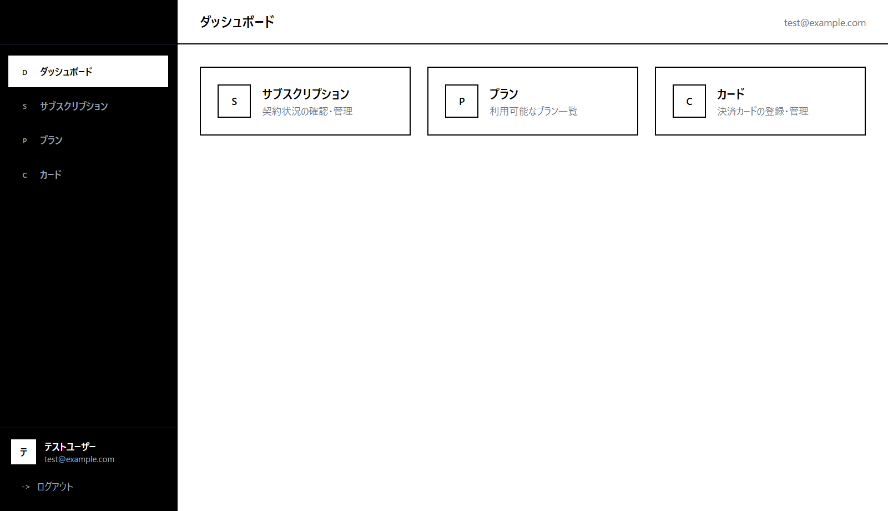

<div align="center">

# fincode Subscription Starter

**決済実装で事故りやすい箇所を、最初から潰してある fincode 定期課金スターター。**

React + FastAPI で書かれた fincode 定期課金の OSS リファレンス実装です。
カードのトークン化、サブスクリプション登録・解約、Webhook の冪等処理、決済履歴、監査ログまで、
そのまま自社サービスに取り込める形で提供します。fincode アカウントが無くても、
モックモードで `docker compose up` するだけで UI と API をすぐ触れます。

[](https://github.com/ltac0203-pixel/fincode-subscription-starter/actions/workflows/ci.yml)
[](./LICENSE)
[](https://www.python.org/downloads/)
[](https://nodejs.org/)
[](https://www.fincode.jp/)



</div>

---

## 30 秒でわかる特徴

- **PAN / CVC をバックエンドに送らない** — ブラウザの fincode.js でトークン化し、REST にはトークンだけ渡す
- **fincode Webhook を冪等に処理** — 受信レベル + upsert レベルの二段冪等で再送に強い
- **Idempotency-Key 再利用 / リトライ / Circuit Breaker** — fincode 書き込みの取りこぼし・二重請求を防ぐ
- **1 ユーザー 1 アクティブ契約を DB が保証** — partial unique index で競合をレースセーフに弾く
- **PostgreSQL + Alembic + SQLAlchemy async** — JSONB と partial unique index を使う本気のスキーマ
- **React + Vite + TypeScript の UI 付き** — 登録・カード・契約・解約・決済履歴まで一通り動く
- **Docker Compose で一括起動** — postgres / backend / frontend がそのまま立ち上がる
- **モックモード搭載** — fincode アカウント無しで UI と API をすぐ試せる

---

## なぜこのリファレンス実装か

| | |
| --- | --- |
| **PAN / CVC はサーバーに来ない** | ブラウザ上の fincode.js でトークン化し、REST にはカードトークンのみ送信。バックエンドはカード番号や CVC を一度も保持しません。PCI DSS の影響範囲を最小化する設計です。 |
| **決済で事故りやすい箇所を先に潰してある** | fincode 書き込みの Idempotency-Key 再利用、5xx / タイムアウト時のリトライ、Circuit Breaker、partial unique index による「1 ユーザー 1 アクティブ契約」の DB 保証など、二重請求・再送・競合といった決済特有の事故をエッジケースから塞いでいます。 |
| **自社サービスに移植しやすい** | fincode 直接呼び出しは `app/services/fincode/` に閉じ込め、Manager 層と REST 層の責務が厳格に分かれています。ドメインロジックの切り出しが容易な構成です。 |

---

## 含まれている機能

- **Google 認証 / JWT** — Google Identity Services の ID トークンをバックエンドで検証し、自前 JWT を発行。パスワードを保持しない構成を `/api/auth/google` の最小実装で提供
- **カードトークン化** — fincode.js の UI コンポーネントを React に組み込み、PAN / CVC をバックエンドに送らずトークンのみを REST に渡す
- **プラン表示と契約登録** — fincode から契約可能なプラン一覧を取得し、契約時には `plan_snapshot` を JSONB で永続化して履歴の意味を保つ
- **解約フロー** — fincode 側の請求を停止し、有料契約は `current_period_end` まで `active` として利用可能にする
- **Webhook 受信と冪等性** — `Fincode-Signature` の HMAC-SHA256 検証 + `webhook_events_seen` と `subscription_results` upsert の二段冪等で再送に強い
- **決済履歴 / ページング** — `subscription_results` に 1 課金 1 行で書き込まれた決済結果を、フロントからページング付きで参照
- **監査ログ** — 成功した業務操作は `audit_logs` に before / after JSONB で記録、失敗は構造化ログにのみ残し PII 漏洩を避ける
- **カード soft delete** — `fincode_cards.deleted_at` で論理削除。過去契約と監査ログの説明可能性を維持し、誤削除からの復旧余地を残す
- **OpenAPI 仕様** — 公開 API は `docs/api/openapi.yml` に定義し、Redocly で lint 通過済み。クライアント自動生成にもそのまま使える

---

## 技術スタック

| レイヤ | 技術 |
| --- | --- |
| フロントエンド | React + Vite + TypeScript + Tailwind CSS v4 |
| バックエンド | FastAPI + Python 3.11+ (uv) |
| API スキーマ | Pydantic v2 / OpenAPI 3.1 |
| データベース | PostgreSQL 16+ |
| ORM / マイグレーション | SQLAlchemy 2.x (async) + Alembic |
| 認証 | Google Identity Services + JWT Bearer |
| 決済 | fincode 定期課金 |
| テスト | pytest + testcontainers + Vitest |

---

## アーキテクチャ

```text
React UI (frontend/src/)
   ↓ REST + JWT Bearer
FastAPI Router (app/api/routes/)
   ↓ Depends(...)
Dependencies (deps / security)
   ↓
Domain Managers (app/services/)
   ↓                       ↓
Fincode Services           PostgreSQL
(app/services/fincode/)
   ↓
FincodeHttpClient → fincode API
```

逆方向の参照は禁止。fincode への HTTP 呼び出しは fincode サービス層に集中し、API ルートや Manager 層から直接 `httpx` を叩くことはありません。詳細は [docs/architecture/overview.md](./docs/architecture/overview.md) を参照。

---

## クイックスタート

最短で動かすなら **モックモード + Docker Compose**。fincode アカウントは要りません。

```bash
git clone https://github.com/ltac0203-pixel/fincode-subscription-starter.git
cd fincode-subscription-starter
cp .env.example .env       # FINCODE_MODE=mock / VITE_FINCODE_MODE=mock が既定で入っている
docker compose up
```

開く:

- フロントエンド: <http://localhost:5173>
- API ドキュメント (Swagger UI): <http://localhost:8000/docs>

postgres / backend / frontend がまとめて起動し、マイグレーションも自動で適用されます。

> **モックモードとは** — fincode を一切呼ばず、プラン一覧・カード登録・契約をダミーデータで再現する開発専用モードです。カード登録フォームはテストトークンを直接入力する簡易フォームに切り替わるので、fincode の公開鍵すら不要。まず UI と API 設計を触りたい人向けの最短経路です。本物の fincode につなぐときは下の「fincode 実環境につなぐ」へ。

### 必要なもの

- Docker Desktop（PostgreSQL とまとめ起動に使用）
- Google OAuth 2.0 クライアント ID（ログインに使用。[Google Cloud Console](https://console.cloud.google.com/apis/credentials) で「ウェブ アプリケーション」として作成し、承認済みの JavaScript 生成元に `http://localhost:5173` を登録。`.env` の `GOOGLE_CLIENT_ID` と `VITE_GOOGLE_CLIENT_ID` に同じ値を設定）
- 個別に起動する場合のみ: Python 3.11+ / [uv](https://docs.astral.sh/uv/) / Node.js 22+
- fincode 実環境につなぐ場合のみ: fincode テストアカウント（テスト API キーとプラン作成）

### fincode 実環境につなぐ（ライブモード）

`.env` のモード設定をライブに切り替え、fincode 管理画面で発行したキーを設定します。

```env
FINCODE_MODE=live
FINCODE_API_KEY=m_test_xxxxxxxxxxxxxxxxxxxxxxx
FINCODE_PUBLIC_KEY=p_test_xxxxxxxxxxxxxxxxxxxxxxx
FINCODE_WEBHOOK_SECRET=...

VITE_FINCODE_MODE=live
VITE_FINCODE_PUBLIC_KEY=p_test_xxxxxxxxxxxxxxxxxxxxxxx
```

テスト用キー（`m_test_*` / `p_test_*`）と `https://api.test.fincode.jp` の組み合わせで動きます。詳細は [docs/getting-started/fincode-setup.md](./docs/getting-started/fincode-setup.md)。ライブモードでは事前に fincode 管理画面で課金プランを作成しておく必要があります。

### 個別に起動する（3 ターミナル）

Docker を使わず各プロセスを手元で動かす場合の手順です（ホットリロードやデバッグ向け）。

<details open>
<summary><strong>ターミナル A — PostgreSQL</strong></summary>

```bash
docker compose up -d postgres
```

`subscription_app` データベースと `app` ユーザーが自動作成されます。`docker compose ps` で `(healthy)` を確認できます。

</details>

<details open>
<summary><strong>ターミナル B — バックエンド (FastAPI, http://localhost:8000)</strong></summary>

```bash
cd backend
uv sync                        # 初回のみ依存をインストール
uv run alembic upgrade head    # マイグレーション適用（初回 + スキーマ更新時）
uv run uvicorn app.main:app --reload
```

`http://localhost:8000/docs` で Swagger UI を確認できます。

</details>

<details open>
<summary><strong>ターミナル C — フロントエンド (Vite, http://localhost:5173)</strong></summary>

```bash
cd frontend
npm install                    # 初回のみ
npm run dev
```

ブラウザで `http://localhost:5173` を開きます。

</details>

### 画面の流れ

モックモードならそのまま操作できます。ライブモードでは事前に fincode 管理画面で課金プランを作成しておいてください（テスト環境で問題ありません）。

1. **ログイン** — `http://localhost:5173/login` で「Google でログイン」ボタンを押して Google アカウントを選択。初回は自動でアカウントが作成されます（要 `GOOGLE_CLIENT_ID` / `VITE_GOOGLE_CLIENT_ID` の設定）。
2. **カード追加** — ナビの「カード」を開いて追加。ライブモードでは fincode.js のフォームで PAN / 有効期限 / CVC を入力（PAN / CVC はサーバーへ送られません。fincode のテストカード番号を使用）。モックモードではテストトークンを直接入力するだけで登録できます。
3. **プラン契約** — ナビの「プラン」→ 支払いカードを選択 → fincode で作成済みのプランから選び「このプランを契約」。
4. **契約の確認・解約** — ナビの「契約」で詳細表示。`解約する` を押すと次回以降の請求を停止し、有料契約は `current_period_end` まで利用できます。
5. **決済履歴** — ナビの「履歴」でページングされた決済結果を表示。Webhook で `subscription_results` に書き込まれた行が出ます。

### Webhook の確認（任意）

決済結果はバックエンドが受信する Webhook に依存します。ローカルで手動投入する例:

```bash
# subscription_id は POST /api/subscription のレスポンス fincode_subscription_id を使う
PAYLOAD='{"event_id":"evt_local_1","event":"subscription.payment.succeeded","data":{"subscription_id":"sub_xxxxx","payment_id":"pay_1","amount":"500","status":"succeeded","charged_at":"2026-05-23T12:00:00Z"}}'
SECRET=change-me   # .env の FINCODE_WEBHOOK_SECRET
SIG=$(printf "%s" "$PAYLOAD" | openssl dgst -sha256 -hmac "$SECRET" -hex | awk '{print $2}')

curl -X POST http://localhost:8000/api/webhooks/fincode \
  -H "Content-Type: application/json" \
  -H "Fincode-Signature: $SIG" \
  -d "$PAYLOAD"
```

PowerShell の例:

```powershell
$payload = '{"event_id":"evt_local_1","event":"subscription.payment.succeeded","data":{"subscription_id":"sub_xxxxx","payment_id":"pay_1","amount":"500","status":"succeeded","charged_at":"2026-05-23T12:00:00Z"}}'
$secret  = 'change-me'
$hmac    = New-Object System.Security.Cryptography.HMACSHA256
$hmac.Key = [Text.Encoding]::UTF8.GetBytes($secret)
$sig     = ($hmac.ComputeHash([Text.Encoding]::UTF8.GetBytes($payload)) | ForEach-Object { $_.ToString('x2') }) -join ''
Invoke-RestMethod -Method Post -Uri 'http://localhost:8000/api/webhooks/fincode' `
  -ContentType 'application/json' `
  -Headers @{ 'Fincode-Signature' = $sig } `
  -Body $payload
```

成功すると 204、フロントの「履歴」画面に行が出ます。本番では fincode 管理画面で `https://YOUR-DOMAIN/api/webhooks/fincode` を Webhook 送信先に登録してください。

---

## よく使うコマンド

| 用途 | コマンド |
| --- | --- |
| DB だけ起動 | `docker compose up -d postgres` |
| DB 停止 | `docker compose stop postgres` |
| DB の中身をリセット | `docker compose down -v` |
| マイグレーション適用 | `cd backend && uv run alembic upgrade head` |
| マイグレーション作成 | `cd backend && uv run alembic revision -m "メッセージ"` |
| 1 つ戻す | `cd backend && uv run alembic downgrade -1` |
| バックエンドだけ再起動 | Ctrl-C 後 `uv run uvicorn app.main:app --reload` |
| バックエンドのテスト | `cd backend && uv run pytest` |
| フロントのテスト | `cd frontend && npm run test:run` |
| OpenAPI 仕様の検証 | `npx @redocly/cli lint docs/api/openapi.yml` |
| 本番ビルド（フロント） | `cd frontend && npm run build` |
| API 仕様ブラウズ | `http://localhost:8000/docs`（Swagger UI） |

---

## うまく動かないとき

| 症状 | 確認 |
| --- | --- |
| `sqlalchemy.exc.OperationalError` で起動失敗 | `docker compose ps` で postgres が `(healthy)` か確認。`.env` の `DATABASE_URL` のポート / パスワードが Compose と一致するか |
| `ModuleNotFoundError` | `cd backend && uv sync` を実行 |
| フロントが API に繋がらない | `.env` の `VITE_API_BASE_URL` と `cors_origins` がブラウザの URL と一致しているか |
| ログイン後すぐ 401 | `JWT_SECRET_KEY` を変えたら既存トークンは無効。ブラウザの localStorage をクリアして再ログイン |
| fincode の API キーが unauthorized | テスト環境キー（`m_test_*` / `p_test_*`）と `https://api.test.fincode.jp` の組み合わせか確認。まずキー無しで触りたいなら `FINCODE_MODE=mock` / `VITE_FINCODE_MODE=mock` |
| カードフォームが `VITE_FINCODE_PUBLIC_KEY is not set.` で失敗 | ライブモードでは公開鍵が必須。鍵を設定するか、`VITE_FINCODE_MODE=mock` でモックモードに切り替える |

---

## 設計上の注意点

### 解約ポリシー

`DELETE /api/subscription` は fincode 側の次回以降の請求を停止します。有料契約で `current_period_end` が未来の場合、ローカル `subscriptions.status` は `active` のまま、`cancelled_at` に解約申込日時を保存し、API は `cancel_at_period_end=true` を返します。フリープラン、または期間末を判断できない契約は即時に `cancelled` へ更新します。

### プラン変更ポリシー

`PATCH /api/subscription` は、解約と再契約を分けて実行せず、既存のアクティブな `subscriptions` 行を同じ行のまま更新します。有料プラン同士の変更では fincode のサブスクリプション更新 API に新しい `plan_id` を渡します。日割り（proration）はこのスターターでは計算しません。

### JWT の保管について

フロントエンドは JWT を `localStorage` に保存します。XSS 経由でトークンを盗まれない設計（Content Security Policy、依存ライブラリの監査、`dangerouslySetInnerHTML` の禁止、ストアド XSS テスト）を本番投入条件にしてください。

---

## API

公開 API は [docs/api/openapi.yml](./docs/api/openapi.yml) に定義します。認証が必要なエンドポイントは次のヘッダーを使います。

```http
Authorization: Bearer <jwt>
```

React フロントエンドが fincode を直接呼び出すのはカードトークン化だけです。それ以外の fincode API 操作は FastAPI のサーバーサイドサービスから実行します。

---

## ディレクトリ構成

```text
app/                  FastAPI バックエンド
app/api/              API router と dependency
app/core/             設定、セキュリティ、ログ
app/models/           SQLAlchemy model
app/schemas/          Pydantic request/response schema
app/services/         subscription / card / customer / fincode サービス
alembic/              DB マイグレーション
frontend/src/         React アプリ
docs/                 ドキュメント
tests/                pytest テスト
```

---

## テスト

```bash
cd backend && uv run pytest --cov=app
cd ../frontend && npm run test:run
npx @redocly/cli lint docs/api/openapi.yml
```

自動テストでは fincode API を直接呼び出さず、サーバーサイドの fincode クライアントをモックします。バックエンドの統合テストは `testcontainers-python` で PostgreSQL を立ち上げるため、Docker が起動している必要があります。

---

## ドキュメント

[docs/README.md](./docs/README.md) から読み始めてください。

- [クイックスタート](./docs/getting-started/quickstart.md)
- [Fincode セットアップ](./docs/getting-started/fincode-setup.md)
- [API 仕様](./docs/api/README.md)
- [アーキテクチャ概要](./docs/architecture/overview.md)
- [環境変数リファレンス](./docs/operations/configuration.md)
- [本番デプロイ](./docs/operations/deployment.md)

---

## セキュリティ

カード番号、CVC、fincode トークン、JWT、API キー、個人情報をログに出さないでください。脆弱性は **公開 Issue ではなく**、GitHub の Private Vulnerability Reporting で非公開に報告してください。手順は [SECURITY.md](./SECURITY.md) を参照。

---

## コントリビュート

Issue / Pull Request 歓迎です。最初に次のドキュメントを読んでください。

- [CONTRIBUTING.md](./CONTRIBUTING.md) — 開発フロー、コミット規約、PR チェックリスト
- [CODE_OF_CONDUCT.md](./CODE_OF_CONDUCT.md) — 行動規範（Contributor Covenant v2.1）
- [SECURITY.md](./SECURITY.md) — 脆弱性報告手順
- [AGENTS.md](./AGENTS.md) — コントリビューター向け詳細ガイド（コーディング規約・テスト方針）

---

## ライセンス

[Apache License, Version 2.0](./LICENSE)。コントリビュートは同ライセンス下で配布されることに同意したものとみなされます。

> fincode は GMO Payment Gateway 株式会社の決済サービスです。本プロジェクトは fincode を利用するための非公式リファレンス実装であり、GMO Payment Gateway 社による公式提供物ではありません。
