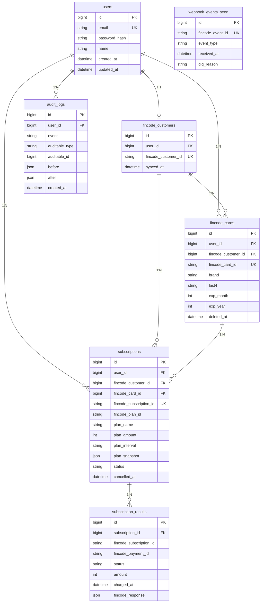

# データモデル

このスターターは PostgreSQL 16+、SQLAlchemy 2.x（async）、Alembic migration を使います。fincodeの識別子をローカルに保持し、フロントエンドには決済サービス内部の詳細を露出しない設計です。

JSONB カラム（`plan_snapshot`、`fincode_response`、`audit_logs.before/after`）と partial unique index（active 契約の一意性）を活用するため、SQLite では代替できません。

## ER図



## 各テーブルの意図

`users` はアプリ側のアイデンティティとパスワードハッシュを保持します。パスワードは passlib や pwdlib などのPython向けライブラリで bcrypt/argon2 を使って保存します。

`fincode_customers` はローカルユーザーと fincode customer ID を 1:1 で対応させます。初回カード登録または契約操作時に遅延作成します。

`fincode_cards` は brand、last4、有効期限、fincode card ID だけを保持します。PAN と CVC は保存しません。過去契約や監査ログを説明できるよう、カードは物理削除ではなく soft delete を基本にします。

`subscriptions` は現在および過去の契約行を保持します。契約作成時点の fincode プラン情報をスナップショット保存し、後から fincode 側でプラン名や金額が変わっても過去契約の意味が変わらないようにします。

`subscription_results` は課金ごとの webhook または照合結果です。Webhook の冪等性には `(fincode_subscription_id, fincode_payment_id)` をキーにした upsert を使います。

`audit_logs` は業務操作の証跡です。誰が何をいつ変えたかを記録し、HTTPリクエスト本文やシークレットは入れません。

## 制約

- `users.email` は unique。
- `fincode_customers.user_id` は unique にし、1ユーザー1カスタマーを保証する。
- アクティブ契約は1ユーザー1件に制限する。PostgreSQL の partial unique index を使う：
  ```python
  op.create_index(
      "uq_subscriptions_active_user",
      "subscriptions",
      ["user_id"],
      unique=True,
      postgresql_where=sa.text("status = 'active'"),
  )
  ```
- 所有関係には外部キーを張る。
- カード削除後も請求履歴と監査ログは説明可能な状態を残す。

## マイグレーション方針

スキーマ変更は Alembic で行います。共有環境に適用済みの migration は編集せず、新しい migration を追加します。原則として downgrade を実装し、forward-only にする場合は理由を明記します。
