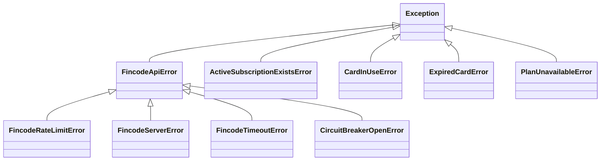
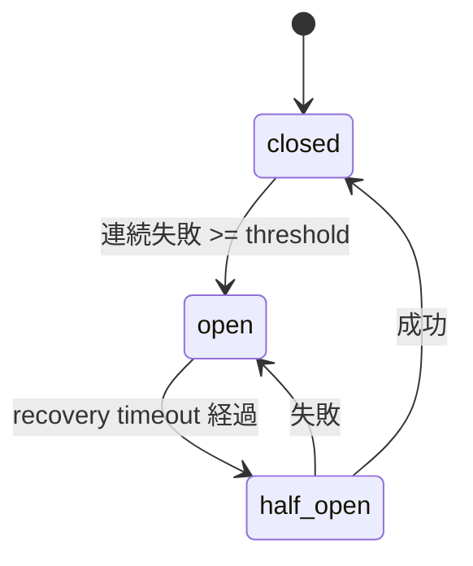

# エラーハンドリング

バックエンドでは、決済プロバイダ側の失敗と、業務ルール側の失敗を分けて扱い、FastAPI の例外ハンドラで安定したレスポンスに変換します。

## 例外系統



- `FincodeApiError` 系は、fincode または通信が原因の失敗。
- 業務例外は、ローカルの不変条件に違反したときに使う。fincode から返ってきた生のレスポンスはクライアントへ返さない。

## HTTPマッピング

| 例外 | HTTPステータス | クライアント表示方針 |
| --- | --- | --- |
| `FincodeRateLimitError` | 429 | 分かる場合は `Retry-After` を付与 |
| `CircuitBreakerOpenError` | 503 | 決済サービスが一時的に利用不可 |
| `FincodeTimeoutError` | 504 | 決済サービスへの接続タイムアウト |
| `FincodeServerError` | 503 | 決済サービス側エラー |
| その他 `FincodeApiError` | 502/503 | 決済通信失敗 |
| `ActiveSubscriptionExistsError` | 409 | 既にアクティブ契約あり |
| `CardInUseError` | 409 | アクティブ契約が参照中のカード |
| `ExpiredCardError` | 422 | 有効期限切れカード |
| `PlanUnavailableError` | 422 | 利用できないプラン |

FastAPI の例外ハンドラは次の形を返します。

```json
{
  "detail": {
    "code": "plan_unavailable",
    "message": "The selected plan is unavailable."
  }
}
```

fincode から返ってきた生のレスポンスボディはクライアントへ返しません。原因調査に必要な情報は、機密部分をマスクしたうえでアプリケーションログに残します。

## Circuit Breaker

Circuit Breaker は、fincode が不調なときにリトライが集中するのを抑え、ユーザーを長く待たせないための仕組みです。



ブレーカが失敗としてカウントするのは HTTP 5xx、タイムアウト、接続失敗などの一時的な障害です。HTTP 4xx と 429 はカウントに含めません。

## 再試行方針

| 原因 | 再試行 | 補足 |
| --- | --- | --- |
| 接続/読み取りタイムアウト | する | 指数バックオフ |
| HTTP 5xx | する | 指数バックオフ |
| HTTP 429 | しない | レート制限に従う |
| HTTP 4xx | しない | 入力または設定の問題 |
| Circuit breaker open | しない | すぐに失敗を返す |

fincode の書き込みAPIを再試行する場合は、同じ Idempotency-Key を再利用します。

## ログと監査

アプリケーションログには method、path、status、latency、request ID、マスク済みメタデータを記録できます。カード番号、CVC、fincodeトークン、JWT、APIキーは出力しません。

`audit_logs` は、成功した業務操作の記録です。失敗した操作は、別途テーブルを追加しない限り構造化ログにのみ残します。
