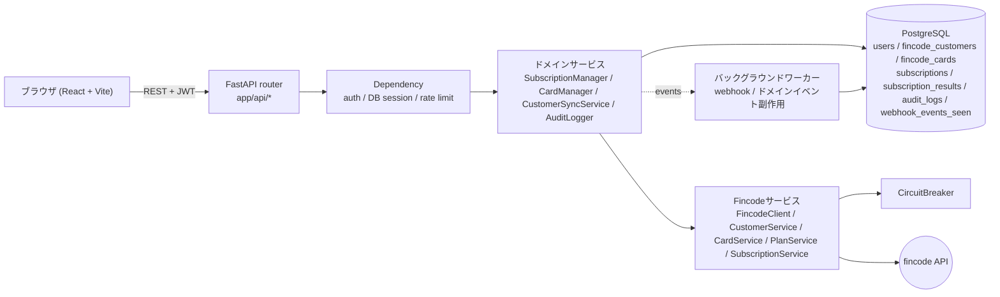
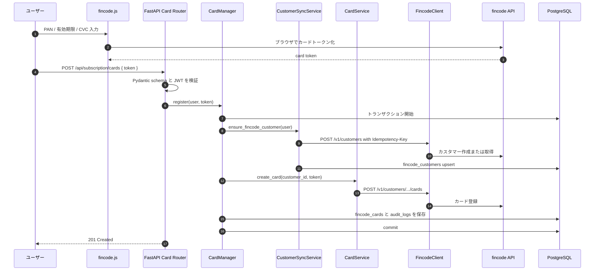
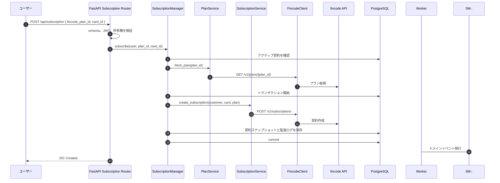

# アーキテクチャ概要

React + FastAPI のサブスクリプションスターターで、リクエストがどのレイヤを通るかをまとめます。

## 全体構成図

ブラウザが fincode を直接呼び出すのはカードトークン化だけです。FastAPI はトークンのみを受け取り、カスタマー、カード、プラン、サブスクリプション、Webhook処理をサーバー側で行います。

## レイヤごとの責務

| レイヤ | 主な場所 | 責務 | やってはいけないこと |
| --- | --- | --- | --- |
| React UI | `frontend/src/` | 画面、フォーム、fincode.jsトークン化、API呼び出し | カード番号やCVCを保持する |
| API router | `app/api/` | ルート定義、request/response schema、dependency接続 | 業務ワークフローを持つ |
| Dependency | `app/api/deps.py`, `app/core/security.py` | JWT検証、current user、DB session、rate limit | fincodeを直接呼ぶ |
| ドメインサービス | `app/services/` | 契約・カード操作、トランザクション、監査ログ | HTTPリクエスト詳細を知る |
| Fincodeサービス | `app/services/fincode/` | 業務呼び出しをfincode APIへ変換 | ローカルDBを直接触る |
| Model | `app/models/` | SQLAlchemy永続化マッピング | 公開APIレスポンスを直接担う |
| Schema | `app/schemas/` | Pydanticバリデーションとレスポンス契約 | DBクエリを発行する |

## シーケンス: カード登録

不変条件:

- PAN と CVC は FastAPI に到達しない。
- 1回のfincode書き込みに対する再試行では同じ Idempotency-Key を使う。
- ローカルDB更新は1トランザクションで行う。
- fincode成功後にローカル保存が失敗した場合は、同期ジョブまたは運用ツールで突合する。

## シーケンス: サブスクリプション登録

不変条件:

- 1ユーザーは最大1つのアクティブ契約だけを持つ。
- プラン名、金額、間隔、fincodeの生ペイロードは契約行へスナップショット保存する。
- ドメインイベントはトランザクション commit 後に発火する。

## バックグラウンド処理

Webhook処理、通知、照合、下流プロビジョニングなどの遅い副作用はワーカープロセスで扱います。Celery、RQ、Dramatiq、軽量なasync task runnerなどを選べますが、API契約はワーカー実装に依存させません。

## 次に読むもの

- [data-model.md](./data-model.md)
- [error-handling.md](./error-handling.md)
- [../api/openapi.yml](../api/openapi.yml)
