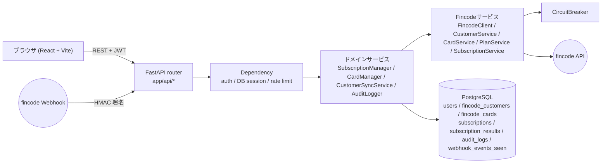
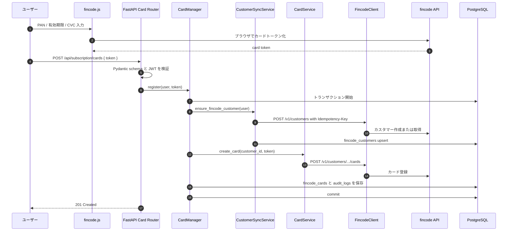
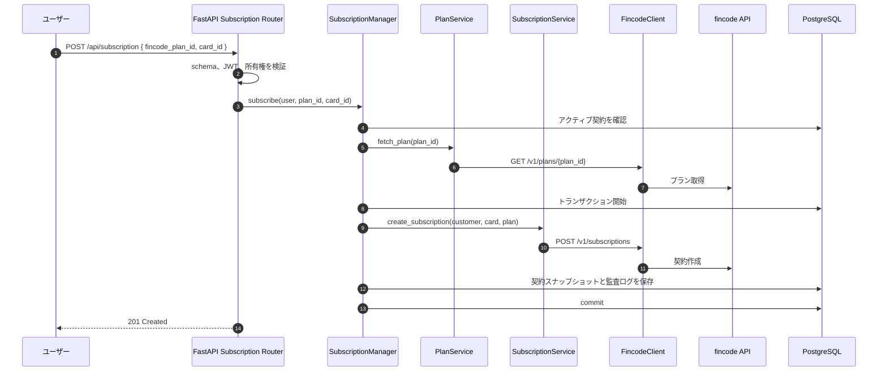

# アーキテクチャ概要

React + FastAPI のサブスクリプションスターターで、リクエストがどのレイヤを通るかをまとめます。

## 全体構成図

ブラウザが fincode を直接呼び出すのは、カードのトークン化だけです。FastAPI はトークンだけを受け取り、カスタマー・カード・プラン・サブスクリプション・Webhook の処理をサーバー側で行います。

## レイヤごとの責務

| レイヤ | 主な場所 | 責務 | やってはいけないこと |
| --- | --- | --- | --- |
| React UI | `frontend/src/` | 画面、フォーム、fincode.jsトークン化、API呼び出し | カード番号やCVCを保持する |
| API router | `app/api/` | ルート定義、request/response schema、dependency接続 | 業務ワークフローを持つ |
| Dependency | `app/api/deps.py`, `app/core/security.py` | JWT検証、current user、DB session、rate limit | fincodeを直接呼ぶ |
| ドメインサービス | `app/services/` | 契約・カード操作、トランザクション、監査ログ | HTTP リクエストの詳細を知る |
| Fincodeサービス | `app/services/fincode/` | 業務的な呼び出しを fincode API へ変換する | ローカル DB を直接触る |
| Model | `app/models/` | SQLAlchemy で DB に保存するためのマッピング | 公開 API のレスポンスをそのまま担う |
| Schema | `app/schemas/` | Pydantic バリデーションとレスポンスの形を定義する | DB クエリを発行する |

## シーケンス: カード登録

不変条件:

- PAN と CVC は FastAPI に届かない。
- 1 回の fincode 書き込みに対する再試行では、同じ Idempotency-Key を使う。
- ローカル DB の更新は 1 トランザクション内で行う。
- fincode への保存が成功した後でローカル保存が失敗した場合は、同期ジョブまたは運用ツールで照合する。

## シーケンス: サブスクリプション登録

不変条件:

- 1 ユーザーは最大 1 つのアクティブ契約だけを持つ。
- プラン名、金額、間隔、fincode から返ってきた生のペイロードは、契約行にスナップショット保存する。

## Webhook 処理

fincode からの定期課金結果 Webhook (`POST /api/webhooks/fincode`) は、本スターターでは **FastAPI プロセス内で同期処理** します。署名検証 → 冪等性チェック (`webhook_events_seen`) → `subscription_results` の upsert までを 1 リクエスト内で終わらせて、204 を返します。

メール通知や下流サービスのセットアップなど、時間のかかる処理を追加する場合は、fork 側で別途キュー / ワーカーを導入してください（本リポジトリには同梱していません）。

## 次に読むもの

- [data-model.md](./data-model.md)
- [error-handling.md](./error-handling.md)
- [../api/openapi.yml](../api/openapi.yml)
